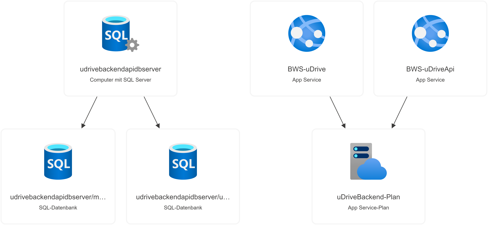
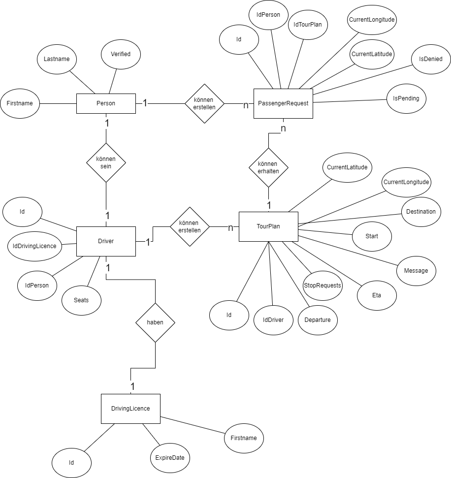

# uDrive.Backend
Diese Dokumentation und Anwendung ist Teil der [uDrive App](https://github.com/BWSuDrive).
 
Die hier zu grundeliegende API und die C# Razor Pages wurden von Benjamin Bigalke [@benwirren](https://github.com/benwirren) entwickelt. 
  
Die Android App [uDrive](https://github.com/BWSuDrive/uDrive.Frontend) nutzt die Api, diese wurde von [Lucas](https://github.com/orgs/BWSuDrive/people/CuzImLloyd), [Nico](https://github.com/orgs/BWSuDrive/people/n-loewen) und [Fabian](https://github.com/orgs/BWSuDrive/people/Skilecto) entwickelt
 
Die gesamte Anwendung wurde im Rahmen einer Projektarbeit an der [Brühlwiesenschule Hofheim](https://bws-hofheim.de/) entwickelt
 
Der großteil der Anleitungen und Tutorials stammen aus den [Dot Net Fundamentels](https://learn.microsoft.com/en-us/dotnet/fundamentals/) und es wurde sich an den [Conventional Commits](https://www.conventionalcommits.org/en/v1.0.0/) gerichtet.
## Entwicklung
Mithilfe von [.Net Framework](https://learn.microsoft.com/de-de/dotnet/) wurde die API erstellt und die Razor Pages, innerhalb von [Visual Studio](https://visualstudio.microsoft.com/de/). 
Zum Testen der API wurde im Vorfeld das Tool (Postman)[https://www.postman.com/] benutzt.
## Deployment und Server
Die Apps werden auf [Microsoft Azure](https://azure.microsoft.com/de-de/) gehostet mit folgenden Plan:

Zum Deployment werden zwei Github Actions genutzt, die sowohl an den Api, als auch an den Web App Server die änderungen deployen.
## Datenmodel
Das Backend liegt folgendem Datenmodel zugrunde 
